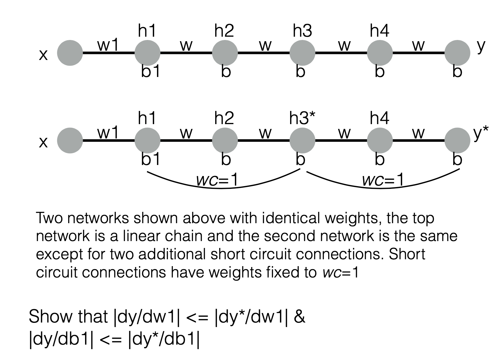
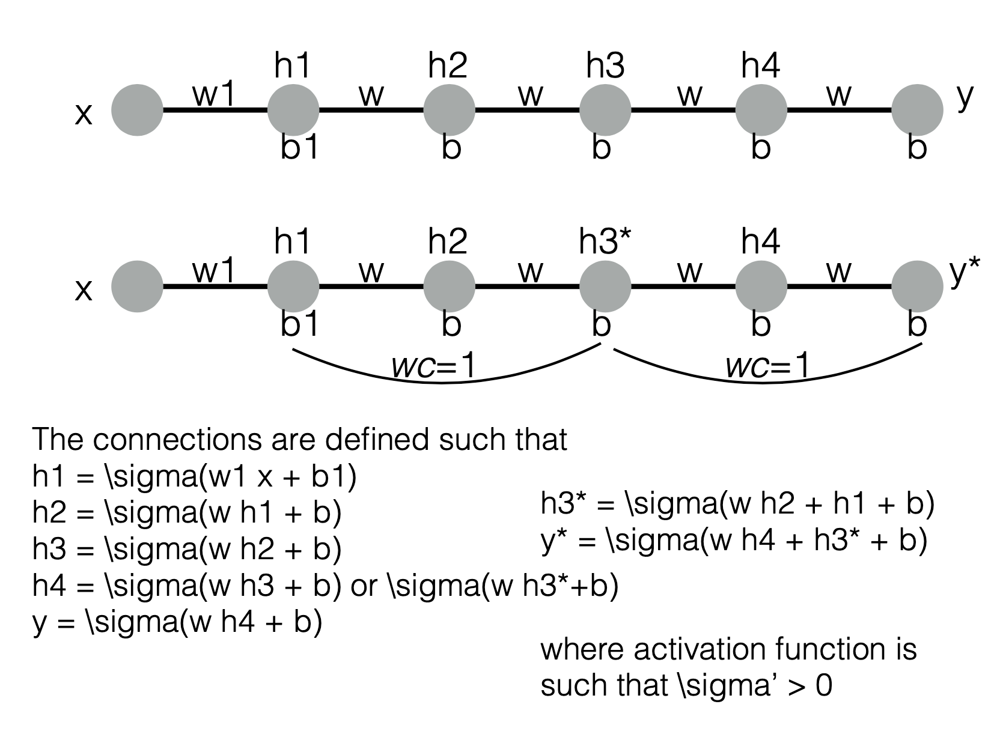
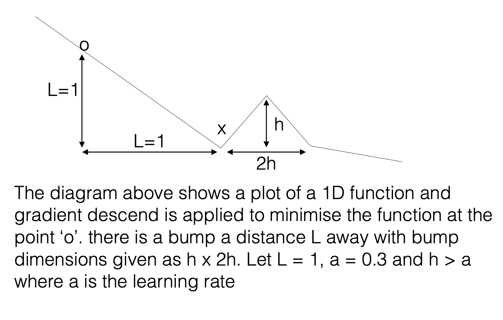
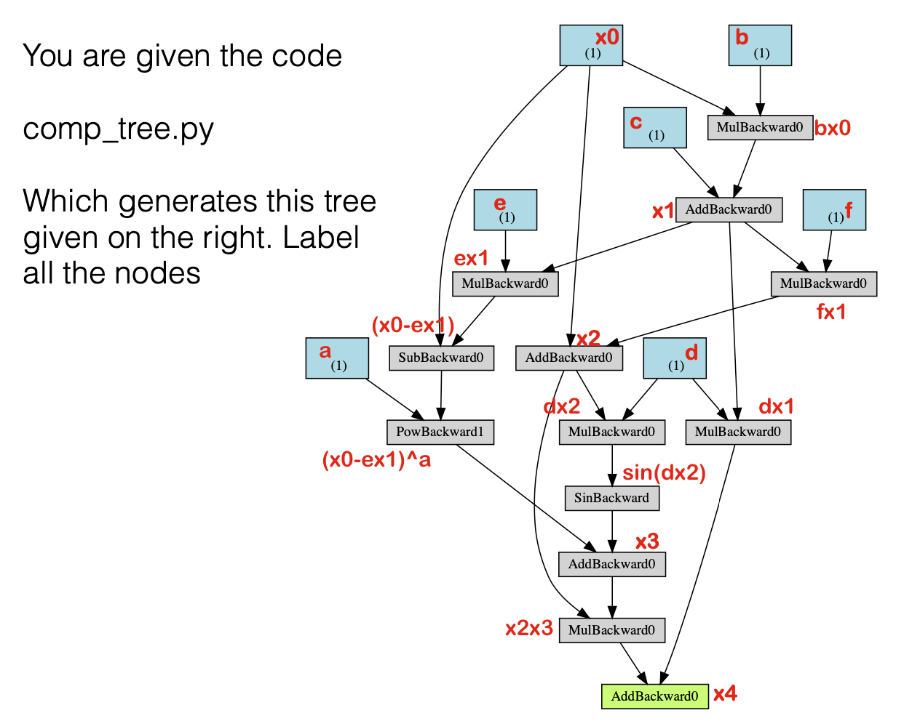
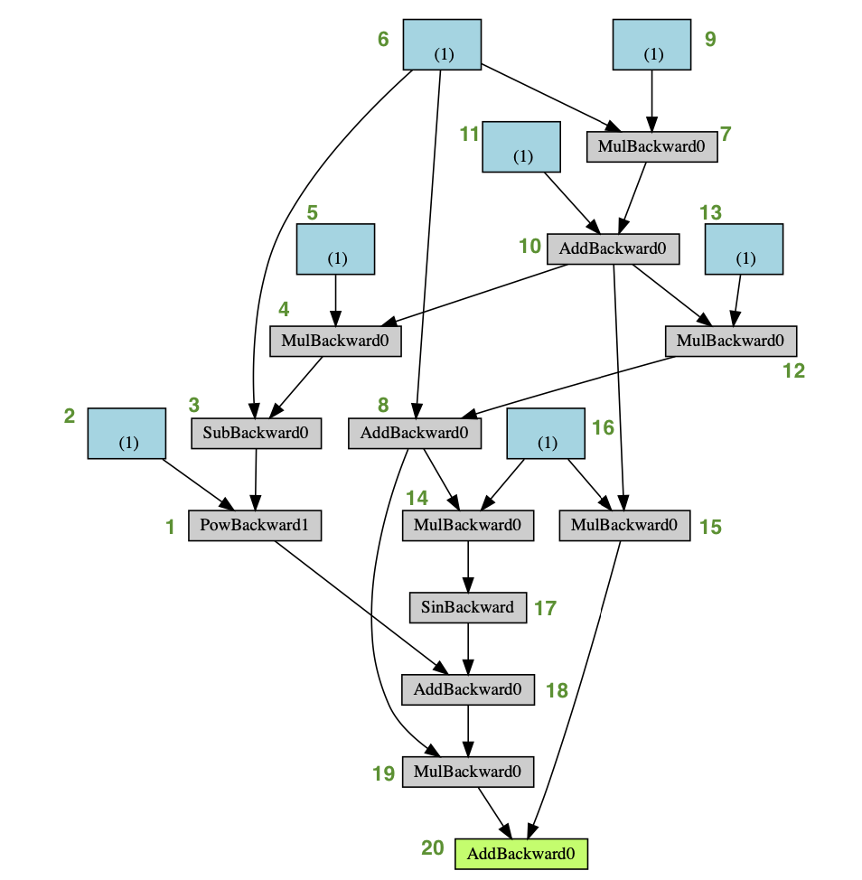

# BS6207_Assignment2

Xinxin <br>
04/Apr/2021

----

## Question 1






On top of the variables given, set:

\begin{equation}
z_1 = xw_1 + b_1;
h_1 = \sigma(z_1) \\
z_2 = h_1w + b;
h_2 = \sigma(z_2) \\
z_3 = h_2w + b;
h_3 = \sigma(z_3) \\
z_4 = h_3w + b;
h_4 = \sigma(z_4) \\
z_5 = h_4w + b;
y = h_5 = \sigma(z_5) \\
z_3^* = h_2w + h_1 + b;
h_3^* = \sigma(z_3^*) \\
z_4^* = h_3^*w + b;
h_4^* = \sigma(z_4^*) \\
z_5^* = h_4^*w + h_3^* + b;
y^* = h_5^* = \sigma(z_5^*) \\
\end{equation}


### Part I. Derivatives against $w_1$
First, derive the expression of $|\frac{\partial y}{\partial w_1}|$ and $|\frac{\partial y*}{\partial w_1}|$:


$$\begin{eqnarray}
|\frac{\partial y}{\partial w_1}| &=& |\frac{\partial y}{\partial z_5} \frac{\partial z_5}{\partial h_4}\frac{\partial h_4}{\partial z_4} \frac{\partial z_4}{\partial h_3}\frac{\partial h_3}{\partial z_3}\frac{\partial z_3}{\partial h_2}\frac{\partial h_2}{\partial z_2}\frac{\partial z_2}{\partial h_1}\frac{\partial h_1}{\partial w_1}| \\
&=& |\sigma'(z_5)w\sigma'(z_4)w\sigma'(z_3)w\sigma'(z_2)w\sigma'(z_1)x| \\
&=& |w^4\sigma'(z_5)\sigma'(z_4)\sigma'(z_3)\sigma'(z_2)\sigma'(z_1)x|
\end{eqnarray}$$

On the other hand:

$$\begin{eqnarray}
|\frac{\partial y^*}{\partial w_1}| &=& |\frac{\partial \sigma(z_5^*)}{\partial w_1}| \\
&=& |\sigma'(z_5^*)[w\frac{\partial h_4^*}{\partial w_1} + \frac{\partial h_3^*}{\partial w_1}]| \\
&=& |\sigma'(z_5^*)[w\frac{\partial h_4^*}{\partial z_4^*}\frac{\partial z_4^*}{\partial h_3^*}\frac{\partial h_3^*}{\partial w_1} + \frac{\partial h_3^*}{\partial w_1}]|\\
&=& |\sigma'(z_5^*)\frac{\partial h_3^*}{\partial w_1}[w\frac{\partial h_4^*}{\partial z_4^*}\frac{\partial z_4^*}{\partial h_3^*} + 1]|
\end{eqnarray}$$


where:

$$\begin{eqnarray}
\frac{\partial h_3^*}{\partial w_1} &=& \sigma'(z_3^*)(w\frac{\partial h_2}{\partial z_2}\frac{\partial z_2}{\partial h_1}\frac{\partial h_1}{\partial w_1}+ \frac{\partial h_1}{\partial w_1}) \\ 
&=& \sigma'(z_3^*)\sigma'(z_1)x[w^2\sigma'(z_2) + 1]
\end{eqnarray}$$

Hence:

$$\begin{eqnarray}
|\frac{\partial y^*}{\partial w_1}|
&=& |\sigma'(z_5^*)\sigma'(z_3^*)\sigma'(z_1)x[w^2\sigma'(z_2) + 1][w\sigma'(z_4^*)w + 1]| \\
&=& |\sigma'(z_5^*)\sigma'(z_3^*)\sigma'(z_1)x[w^2\sigma'(z_2) + 1][w^2\sigma'(z_4^*) + 1]| \\
&>& |w^4\sigma'(z_5^*)\sigma'(z_4^*)\sigma'(z_3^*)\sigma'(z_2)\sigma'(z_1)x|
\end{eqnarray}$$

As $z_5^* > z_5, z_4^* > z_4, z_3^* > z_3$, and $\sigma'>0$: 

1. If we assume $\sigma" > 0$, then $\sigma'$ is monotonously increasing, i.e. $\sigma'(z_5^*) > \sigma'(z_5), \sigma'(z_4^*) > \sigma'(z_4), \sigma(z_3^*) > \sigma'(z_3)$. Thus:

$$\begin{eqnarray}
|\frac{\partial y^*}{\partial w_1}| > |w^4\sigma'(z_5^*)\sigma'(z_4^*)\sigma'(z_3^*)\sigma'(z_2)\sigma'(z_1)x| &>& |w^4\sigma'(z_5)\sigma'(z_4)\sigma'(z_3)\sigma'(z_2)\sigma'(z_1)x| = |\frac{\partial y}{\partial w_1}| \\
|\frac{\partial y^*}{\partial w_1}| &>& |\frac{\partial y}{\partial w_1}|
\end{eqnarray}$$


2. If $\sigma" \leq 0$, then we can't compare the values of $\sigma'$. Hence, it's unable to prove that $|\frac{\partial y^*}{\partial w_1}| > |\frac{\partial y}{\partial w_1}|$.

### Part II. Derivatives against $b_1$

Similarly, $|\frac{\partial y}{\partial b_1}|$ and $|\frac{\partial y^*}{\partial b_1}|$ can be derived as below:

$$\begin{eqnarray}
|\frac{\partial y}{\partial b_1}| &=& |\frac{\partial y}{\partial z_5} \frac{\partial z_5}{\partial h_4}\frac{\partial h_4}{\partial z_4} \frac{\partial z_4}{\partial h_3}\frac{\partial h_3}{\partial z_3}\frac{\partial z_3}{\partial h_2}\frac{\partial h_2}{\partial z_2}\frac{\partial z_2}{\partial h_1}\frac{\partial h_1}{\partial b_1}| \\
&=& |\sigma'(z_5)w\sigma'(z_4)w\sigma'(z_3)w\sigma'(z_2)w\sigma'(z_1)| \\
&=& |w^4\sigma'(z_5)\sigma'(z_4)\sigma'(z_3)\sigma'(z_2)\sigma'(z_1)|
\end{eqnarray}$$


$$\begin{eqnarray}
|\frac{\partial y^*}{\partial b_1}| &=& |\frac{\partial \sigma(z_5^*)}{\partial b_1}| \\
&=& |\sigma'(z_5^*)[w\frac{\partial h_4^*}{\partial b_1} + \frac{\partial h_3^*}{\partial b_1}]| \\
&=& |\sigma'(z_5^*)[w\frac{\partial h_4^*}{\partial z_4^*}\frac{\partial z_4^*}{\partial h_3^*}\frac{\partial h_3^*}{\partial b_1} + \frac{\partial h_3^*}{\partial b_1}]|\\
&=& |\sigma'(z_5^*)\frac{\partial h_3^*}{\partial b_1}[w\frac{\partial h_4^*}{\partial z_4^*}\frac{\partial z_4^*}{\partial h_3^*} + 1]| \\
&=& |\sigma'(z_5^*)\sigma'(z_3^*)\sigma'(z_1)[w^2\sigma'(z_2) + 1][w^2\sigma'(z_4^*) + 1]| \\
&>& |w^4\sigma'(z_5^*)\sigma'(z_4^*)\sigma'(z_3^*)\sigma'(z_2)\sigma'(z_1)|
\end{eqnarray}$$

Similar to Part I, as $z_5^* > z_5, z_4^* > z_4, z_3^* > z_3$, and $\sigma'>0$: 

1. If we assume $\sigma" > 0$, then $\sigma'$ is monotonously increasing, i.e. $\sigma'(z_5^*) > \sigma'(z_5), \sigma'(z_4^*) > \sigma'(z_4), \sigma(z_3^*) > \sigma'(z_3)$. Thus:

$$\begin{eqnarray}
|\frac{\partial y^*}{\partial b_1}| > |w^4\sigma'(z_5^*)\sigma'(z_4^*)\sigma'(z_3^*)\sigma'(z_2)\sigma'(z_1)| &>& |w^4\sigma'(z_5)\sigma'(z_4)\sigma'(z_3)\sigma'(z_2)\sigma'(z_1)| = |\frac{\partial y}{\partial b_1}| \\
|\frac{\partial y^*}{\partial b_1}| &>& |\frac{\partial y}{\partial b_1}|
\end{eqnarray}$$


2. If $\sigma" \leq 0$, then we can't compare the values of $\sigma'$. Hence, it's unable to prove that $|\frac{\partial y^*}{\partial b_1}| > |\frac{\partial y}{\partial b_1}|$.

-----

## Question 2




#### a) What will happen if you apply standard gradient descend?

It will stuck at the local minima at x, as proved below:


```python
# define function of the derivative of the given 1D function
def loss_der(theta):
    if theta < 0:
        return -1
    elif 0 < theta < 0.31:
        return 1
    elif 2*0.31> theta > 0.31:
        return -1
    else:
        return -0.5
```


```python
import numpy as np
```


```python
# define initial status
l = [-1]
k = [-1] # initial location on x-axis
for i in range(1, 20): # loop through from time point 1 to 19
    if l[-1] < 0: # move rightward
        temp_k = k[-1] + 0.3
        k.append(round(temp_k, 3))
        temp_l = loss_der(temp_k)
        l.append(temp_l)
    elif l[-1] > 0: # move leftward
        temp_k = k[-1] - 0.3
        k.append(round(temp_k, 3))
        temp_l = loss_der(temp_k)
        l.append(temp_l)
    elif l[-1] == 0: # minima found
        break
```


```python
# print the result
for i in range(20):
    print('At time', i, ': location of point `o` on x-axis is', k[i], 'with slope of', l[i])
```

    At time 0 : location of point `o` on x-axis is -1 with slope of -1
    At time 1 : location of point `o` on x-axis is -0.7 with slope of -1
    At time 2 : location of point `o` on x-axis is -0.4 with slope of -1
    At time 3 : location of point `o` on x-axis is -0.1 with slope of -1
    At time 4 : location of point `o` on x-axis is 0.2 with slope of 1
    At time 5 : location of point `o` on x-axis is -0.1 with slope of -1
    At time 6 : location of point `o` on x-axis is 0.2 with slope of 1
    At time 7 : location of point `o` on x-axis is -0.1 with slope of -1
    At time 8 : location of point `o` on x-axis is 0.2 with slope of 1
    At time 9 : location of point `o` on x-axis is -0.1 with slope of -1
    At time 10 : location of point `o` on x-axis is 0.2 with slope of 1
    At time 11 : location of point `o` on x-axis is -0.1 with slope of -1
    At time 12 : location of point `o` on x-axis is 0.2 with slope of 1
    At time 13 : location of point `o` on x-axis is -0.1 with slope of -1
    At time 14 : location of point `o` on x-axis is 0.2 with slope of 1
    At time 15 : location of point `o` on x-axis is -0.1 with slope of -1
    At time 16 : location of point `o` on x-axis is 0.2 with slope of 1
    At time 17 : location of point `o` on x-axis is -0.1 with slope of -1
    At time 18 : location of point `o` on x-axis is 0.2 with slope of 1
    At time 19 : location of point `o` on x-axis is -0.1 with slope of -1


- At timepoint 3 (i.e. 3rd iteration), point `o` reaches -0.1 on x-axis with a negative slope. Hence, it continues moving to the right. <br>
- At timepoint 4 (i.e. 4th iteration), point `o` reaches 0.2 on x-axis with a positive slope. Hence, it should move to the left instead. <br>
- With the learning rate of 0.3, at timepoint 5, point `o` reaches -0.1 on x-axis again. It startes to oscillate between -0.1 and 0.2 afterwards, and is trapped at the local minima of `x`.

#### b) if you apply adam optimisation with parameters given in the next slide, what is the max height ‘h’ of the bump in which the adam optimiser will escape the local min at ‘x’? use $\epsilon = 0$ instead of $\epsilon = 1e-8$ in your calculations.

Assume the local minima (point `x`) is the origin (i.e. x = 0). The starting point `o` can be denoted as (-1, 1). Assume the gradient of the 1D function beyond `2h` is -0.5. This is for the ease of defining the derivative of the given 1D function, and the value is taken arbitarily, which should not impact the final result of maximum h.


```python
# define function of the derivative of the given 1D function
def loss_der1(theta, h):
    if theta < 0:
        return -1
    elif 0 < theta < h:
        return 1
    elif 2*h> theta > h:
        return -1
    else:
        return -0.5
```


```python
# loop through h from 0.3 to 100 with step size of 0.01
theta_lst = []
for h in np.arange(0.301, 100, 0.001):
    # define initial status
    m = [0]
    m_hat = [0]
    v = [0]
    v_hat = [0]
    theta = [-1]
    g = [-1]
    
    # for each h, apply adam optimizer to minimize the loss function
    for t in range(1, 30):
        g.append(loss_der1(theta[-1], h)) # gradient at timestep t
        m.append(0.9 * m[-1] + (1 - 0.9) * g[-1]) # biased first moment estimate
        m_hat.append(m[-1] / (1 - 0.9 ** t)) # bias-corrected first moment estimate
        v.append(0.999 * v[-1] + (1 - 0.999) * g[-1] ** 2) # biased second raw moment estimate
        v_hat.append(v[-1] / (1- 0.999 ** t)) # bias-corrected second raw moment estimate
        theta.append(theta[-1] - (0.3 * m_hat[-1] / v_hat[-1] ** 0.5)) # location of point `o` at timestep t
        
    # record the last position of o
    theta_lst.append(round(theta[-1],3))
    
    # check the position of theta at time = 30
    # if it's still smaller than h -> still stuck at local minimum x
    if theta[-1] < h:
        print('Maximum height of bump:', round(h-0.001,3)) # return the previous h value
        break
```

    Maximum height of bump: 0.41


```python
# print the result with different values of h
h = np.arange(0.301,0.412,0.001)
for i in range(111):
    print('When h =', round(h[i],3), ': last position of `o` on x-axis is', theta_lst[i])
```

    When h = 0.301 : last position of `o` on x-axis is 5.579
    When h = 0.302 : last position of `o` on x-axis is 5.579
    When h = 0.303 : last position of `o` on x-axis is 5.579
    When h = 0.304 : last position of `o` on x-axis is 5.579
    When h = 0.305 : last position of `o` on x-axis is 5.579
    When h = 0.306 : last position of `o` on x-axis is 5.579
    When h = 0.307 : last position of `o` on x-axis is 5.579
    When h = 0.308 : last position of `o` on x-axis is 5.579
    When h = 0.309 : last position of `o` on x-axis is 5.579
    When h = 0.31 : last position of `o` on x-axis is 5.579
    When h = 0.311 : last position of `o` on x-axis is 5.579
    When h = 0.312 : last position of `o` on x-axis is 5.579
    When h = 0.313 : last position of `o` on x-axis is 5.579
    When h = 0.314 : last position of `o` on x-axis is 5.579
    When h = 0.315 : last position of `o` on x-axis is 5.579
    When h = 0.316 : last position of `o` on x-axis is 5.579
    When h = 0.317 : last position of `o` on x-axis is 5.579
    When h = 0.318 : last position of `o` on x-axis is 5.579
    When h = 0.319 : last position of `o` on x-axis is 5.579
    When h = 0.32 : last position of `o` on x-axis is 5.579
    When h = 0.321 : last position of `o` on x-axis is 5.579
    When h = 0.322 : last position of `o` on x-axis is 5.579
    When h = 0.323 : last position of `o` on x-axis is 5.579
    When h = 0.324 : last position of `o` on x-axis is 5.579
    When h = 0.325 : last position of `o` on x-axis is 5.579
    When h = 0.326 : last position of `o` on x-axis is 5.579
    When h = 0.327 : last position of `o` on x-axis is 5.579
    When h = 0.328 : last position of `o` on x-axis is 5.579
    When h = 0.329 : last position of `o` on x-axis is 5.579
    When h = 0.33 : last position of `o` on x-axis is 5.579
    When h = 0.331 : last position of `o` on x-axis is 5.579
    When h = 0.332 : last position of `o` on x-axis is 5.579
    When h = 0.333 : last position of `o` on x-axis is 5.579
    When h = 0.334 : last position of `o` on x-axis is 5.579
    When h = 0.335 : last position of `o` on x-axis is 5.579
    When h = 0.336 : last position of `o` on x-axis is 5.579
    When h = 0.337 : last position of `o` on x-axis is 5.579
    When h = 0.338 : last position of `o` on x-axis is 5.579
    When h = 0.339 : last position of `o` on x-axis is 5.579
    When h = 0.34 : last position of `o` on x-axis is 5.579
    When h = 0.341 : last position of `o` on x-axis is 5.579
    When h = 0.342 : last position of `o` on x-axis is 5.579
    When h = 0.343 : last position of `o` on x-axis is 5.579
    When h = 0.344 : last position of `o` on x-axis is 5.579
    When h = 0.345 : last position of `o` on x-axis is 5.579
    When h = 0.346 : last position of `o` on x-axis is 5.579
    When h = 0.347 : last position of `o` on x-axis is 5.579
    When h = 0.348 : last position of `o` on x-axis is 5.579
    When h = 0.349 : last position of `o` on x-axis is 5.579
    When h = 0.35 : last position of `o` on x-axis is 5.579
    When h = 0.351 : last position of `o` on x-axis is 5.579
    When h = 0.352 : last position of `o` on x-axis is 5.579
    When h = 0.353 : last position of `o` on x-axis is 5.579
    When h = 0.354 : last position of `o` on x-axis is 4.753
    When h = 0.355 : last position of `o` on x-axis is 4.753
    When h = 0.356 : last position of `o` on x-axis is 4.753
    When h = 0.357 : last position of `o` on x-axis is 4.753
    When h = 0.358 : last position of `o` on x-axis is 4.753
    When h = 0.359 : last position of `o` on x-axis is 4.753
    When h = 0.36 : last position of `o` on x-axis is 4.753
    When h = 0.361 : last position of `o` on x-axis is 4.753
    When h = 0.362 : last position of `o` on x-axis is 4.753
    When h = 0.363 : last position of `o` on x-axis is 4.753
    When h = 0.364 : last position of `o` on x-axis is 4.753
    When h = 0.365 : last position of `o` on x-axis is 4.753
    When h = 0.366 : last position of `o` on x-axis is 4.753
    When h = 0.367 : last position of `o` on x-axis is 4.753
    When h = 0.368 : last position of `o` on x-axis is 4.753
    When h = 0.369 : last position of `o` on x-axis is 4.753
    When h = 0.37 : last position of `o` on x-axis is 4.753
    When h = 0.371 : last position of `o` on x-axis is 4.753
    When h = 0.372 : last position of `o` on x-axis is 4.753
    When h = 0.373 : last position of `o` on x-axis is 4.753
    When h = 0.374 : last position of `o` on x-axis is 4.753
    When h = 0.375 : last position of `o` on x-axis is 4.753
    When h = 0.376 : last position of `o` on x-axis is 4.753
    When h = 0.377 : last position of `o` on x-axis is 4.753
    When h = 0.378 : last position of `o` on x-axis is 4.753
    When h = 0.379 : last position of `o` on x-axis is 4.753
    When h = 0.38 : last position of `o` on x-axis is 4.753
    When h = 0.381 : last position of `o` on x-axis is 4.753
    When h = 0.382 : last position of `o` on x-axis is 4.753
    When h = 0.383 : last position of `o` on x-axis is 4.753
    When h = 0.384 : last position of `o` on x-axis is 4.753
    When h = 0.385 : last position of `o` on x-axis is 4.753
    When h = 0.386 : last position of `o` on x-axis is 4.753
    When h = 0.387 : last position of `o` on x-axis is 4.753
    When h = 0.388 : last position of `o` on x-axis is 4.753
    When h = 0.389 : last position of `o` on x-axis is 4.753
    When h = 0.39 : last position of `o` on x-axis is 4.753
    When h = 0.391 : last position of `o` on x-axis is 4.753
    When h = 0.392 : last position of `o` on x-axis is 4.753
    When h = 0.393 : last position of `o` on x-axis is 4.753
    When h = 0.394 : last position of `o` on x-axis is 4.753
    When h = 0.395 : last position of `o` on x-axis is 4.753
    When h = 0.396 : last position of `o` on x-axis is 4.753
    When h = 0.397 : last position of `o` on x-axis is 4.753
    When h = 0.398 : last position of `o` on x-axis is 4.753
    When h = 0.399 : last position of `o` on x-axis is 4.753
    When h = 0.4 : last position of `o` on x-axis is 4.753
    When h = 0.401 : last position of `o` on x-axis is 4.753
    When h = 0.402 : last position of `o` on x-axis is 4.753
    When h = 0.403 : last position of `o` on x-axis is 4.753
    When h = 0.404 : last position of `o` on x-axis is 4.753
    When h = 0.405 : last position of `o` on x-axis is 4.753
    When h = 0.406 : last position of `o` on x-axis is 4.753
    When h = 0.407 : last position of `o` on x-axis is 4.753
    When h = 0.408 : last position of `o` on x-axis is 4.825
    When h = 0.409 : last position of `o` on x-axis is 4.825
    When h = 0.41 : last position of `o` on x-axis is 4.825
    When h = 0.411 : last position of `o` on x-axis is 0.123


```python
# print the location of `o` with h = 0.411
for t in range(30):
    print('At timepoint', t, ': location of `o` on x-axis is', round(theta[t],3))
```

    At timepoint 0 : location of `o` on x-axis is -1
    At timepoint 1 : location of `o` on x-axis is -0.7
    At timepoint 2 : location of `o` on x-axis is -0.4
    At timepoint 3 : location of `o` on x-axis is -0.1
    At timepoint 4 : location of `o` on x-axis is 0.2
    At timepoint 5 : location of `o` on x-axis is 0.353
    At timepoint 6 : location of `o` on x-axis is 0.41
    At timepoint 7 : location of `o` on x-axis is 0.399
    At timepoint 8 : location of `o` on x-axis is 0.336
    At timepoint 9 : location of `o` on x-axis is 0.235
    At timepoint 10 : location of `o` on x-axis is 0.103
    At timepoint 11 : location of `o` on x-axis is -0.053
    At timepoint 12 : location of `o` on x-axis is -0.145
    At timepoint 13 : location of `o` on x-axis is -0.185
    At timepoint 14 : location of `o` on x-axis is -0.181
    At timepoint 15 : location of `o` on x-axis is -0.14
    At timepoint 16 : location of `o` on x-axis is -0.067
    At timepoint 17 : location of `o` on x-axis is 0.034
    At timepoint 18 : location of `o` on x-axis is 0.087
    At timepoint 19 : location of `o` on x-axis is 0.099
    At timepoint 20 : location of `o` on x-axis is 0.076
    At timepoint 21 : location of `o` on x-axis is 0.022
    At timepoint 22 : location of `o` on x-axis is -0.06
    At timepoint 23 : location of `o` on x-axis is -0.099
    At timepoint 24 : location of `o` on x-axis is -0.102
    At timepoint 25 : location of `o` on x-axis is -0.072
    At timepoint 26 : location of `o` on x-axis is -0.013
    At timepoint 27 : location of `o` on x-axis is 0.071
    At timepoint 28 : location of `o` on x-axis is 0.115
    At timepoint 29 : location of `o` on x-axis is 0.123


The last locations of point `o` after 29 iterations with different value of `h` are printed as above.

For any value of `h` larger than 0.3 (i.e. learning rate) and lower than 0.411 (wutg increment of 0.01), the last location of point `o` on x-axis is larger than the corresponding `h`, indicating that `o` has escaped the local minima at `x`.

With `h` = 0.411, the point `o` cannot escape the local minima within 29 iterations. In fact, at timepoint 6, location of `o` on x-axis is 1.0.41. However, instead of keeping moving to the right to escape the local minima, at timepoint7, `o` moved leftwards to 0.399. It keeps oscillating around the local minima afterwards.

__Hence, with $\beta_1 = 0.9, \beta_2 = 0.999, \epsilon = 0, \alpha = 0.3$, the maximum height of `h` of the bump is 0.410 for adam optimiser to be able to escape the local minimum at `x`.__

----

## Question 3

The nodes are labeld in __<span style="color:red">red</span>__ based on `comp_tree.py`.



__Working process__

From `comp_tree.py`, we can derive that _(nodes are denoted as the graph below in green for the ease of annotations)_:
1. $a$ only takes part in the power calculation (i.e. `box1` = $(x_0 - ex_1)^2$). Hence, `box2` is $a$.
2. `box3` connected to `PowBackward` (`box1`) is ($x_0 - e x_1$), from which we can work backward to get that `box6` is $x_0$, and the connected `MulBackward0` (`box4`) is $e x_1$. Thus, `box5` connected to the `MulBackward0`(`box4`) is $e$, and `box10` is $x_1$.
3. From `box10` = $x_1$ and the equation $x_1 = bx_0 + c$, we can get `box11` is $c$, `box7` is $bx_0$, `box9` is $b$, and `box6` is $x_0$.
4. Moving down from `box10` = $x_1$ and `box6` = $x_0$, as we have $x_2 = x_0 + x_1f$, we can get `box8` is $x_2$, `box13` is $f$, and `box12` is $x_1f$.
5. As `box17` contains a sin calculation, it is $sin(dx_2)$. Thus, `box14` is $dx_2$ and `box16` is $d$. Moving from `box17` downwards, as we know $x_3 = (x_0 - e x_1)^a + sin(dx_2)$, `box18` = $x_3$, and `box19` = $x_3x_2$.
6. From `box16` = $d$ and `box10` = $x_1$, we can get `box15` = $dx_1$.
7. `box20` is $x_4$, deriving from the value of `box19` and `box15`.


